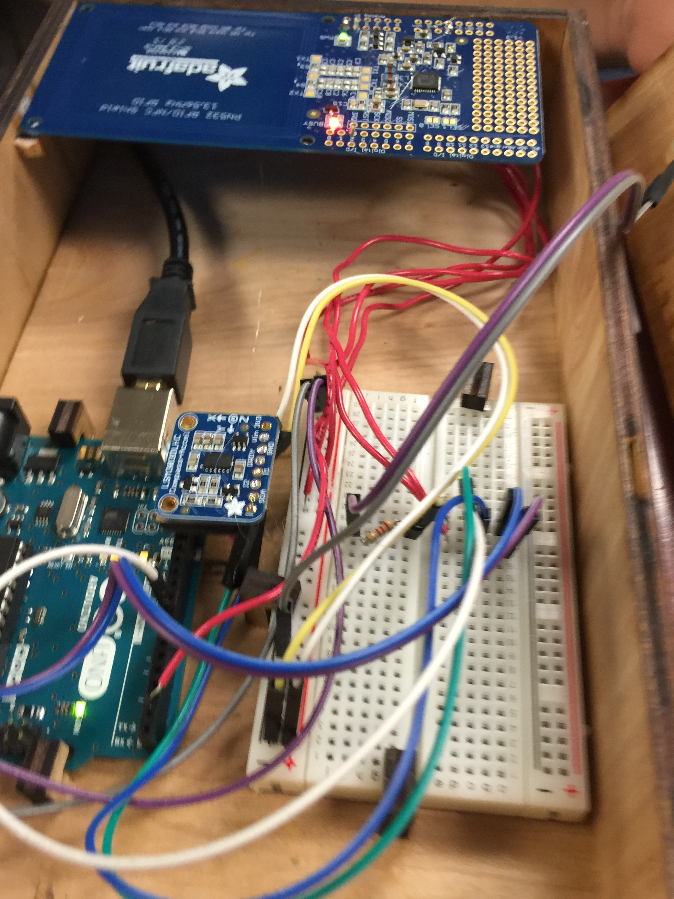
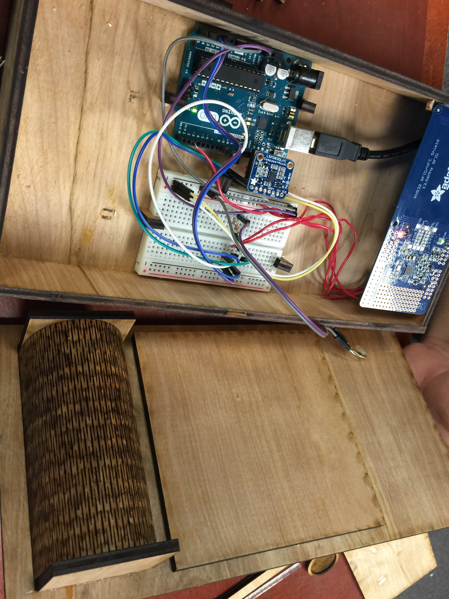
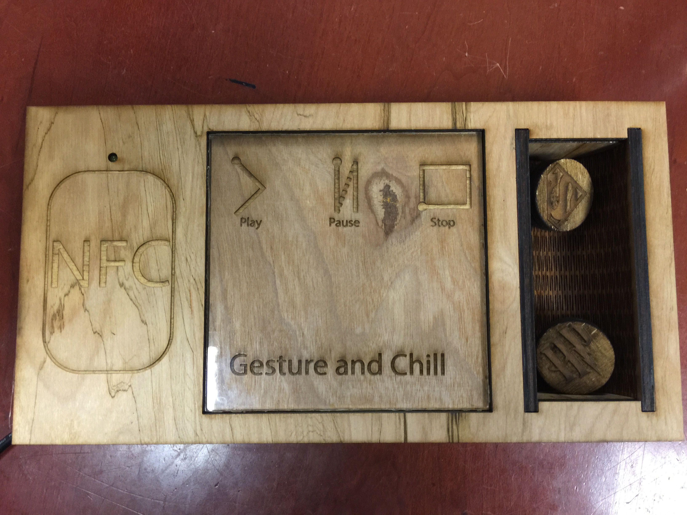
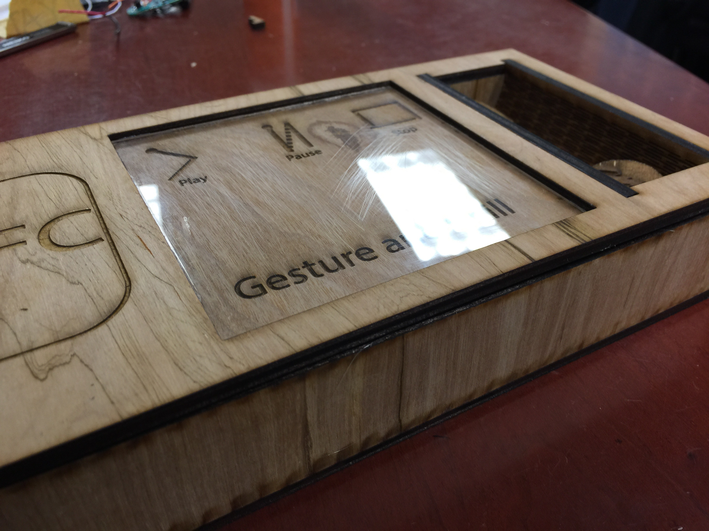

# Gesture and Chill (Trademark pending)

With the imminent decline on movie theater attendance, and
consequentially growth of the streaming industry; a new public has
emerged. We present in this effort to improve the experience of the
home stream significantly. Gesture and Chill is a "remote control" in
a box that will control different parts of this experience: from
controlling the playback of a given media, to lightning control on
your environment.

## Build Process
To complete this project, as with all projects in this course, we had
to get our hands dirty in the line where hardware and software meet.
Here's a brief summary of our process.

### Software

#### Plex Media Server / Plex Home Theater
To present our media, we made use of Plex Media Server. This solution
based on a client-server architecture allows its users to stream media
from their server to anywhere in the world with an Internet
connection.

This solution also empowers us with an [unofficial
API](https://github.com/Arcanemagus/plex-api/wiki) that allows us to
perform tools from server management to client playback control.
Focusing on playback control, we were able to isolate four (4)
pertinent API calls for play, pause and stop functions.

#### NodeJS Server
To manage all the incoming and outgoing requests, we setup a NodeJS
server. This server will be the responsible for translating
information received from the "Gesture Box" to HTTP requests to all
the other components. Also tasked with gesture identification and data
segmentation, this server is physically connected to our Gesture Box
due to hardware constraints.

#### $1 Recognizer
To complete the stroke recognizer section of our project, we made use
of the library [$1
Recognizer](https://depts.washington.edu/aimgroup/proj/dollar/). This
API allows us to identify strokes based on little training data using
Dynamic Time Warping, aiding us yield classification accuracies as
high as 75%.

### Hardware Design

#### Brains
The brains of this operations, aside from the previously described
NodeJS server, are an Arduino Uno and a Particle's Photon. While the
Photon had the simple task of turning on and off the lights using a
relay, the Arduino had a little more complicated task.

The Arduino's responsibility was to send the information it received
from the magnetometer and NFC Shield to the NodeJS server, where all
the hard logic lies.

#### RFID Tags/Reader
To represent each show, we designed individualized, representative
tags. These tags have embedded RFID tags in them so that our gadget is
able to identify them as well as we do.

#### Magnets
To successfully map the movement of our RFID-enabled tokens, we
attached a magnet inside each of them and track their movements with a
magnetometer. Sampling at 10 Hz, approximately, we were able to get
enough samples to create a stroke of sorts and have it analyzed by our
stroke recognizer.

## Media

### Pictures

### Video
Please find our demo video
[here](https://www.youtube.com/watch?v=7oVUjyiay7o).
